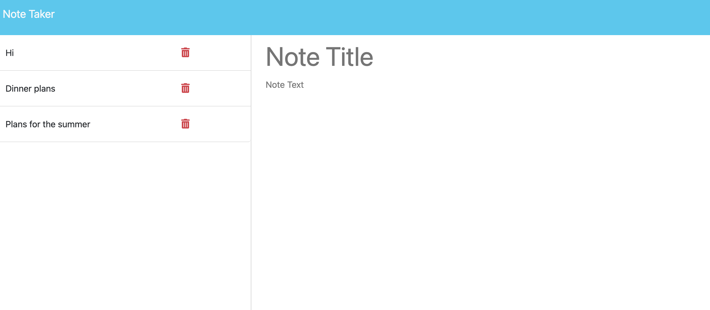

# Note Taker Starter Code

# Note Taker Application

## Description
The Note Taker application allows small business owners to write, save, and organize their notes. This application provides a simple and effective way to keep track of tasks and organize thoughts.

## User Story
AS A small business owner  
I WANT to be able to write and save notes  
SO THAT I can organize my thoughts and keep track of tasks I need to complete  

## Acceptance Criteria
- **GIVEN** a note-taking application
  - **WHEN** I open the Note Taker
    - **THEN** I am presented with a landing page with a link to a notes page
  - **WHEN** I click on the link to the notes page
    - **THEN** I am presented with a page with existing notes listed in the left-hand column, plus empty fields to enter a new note title and the note’s text in the right-hand column
  - **WHEN** I enter a new note title and the note’s text
    - **THEN** a "Save Note" button and a "Clear Form" button appear in the navigation at the top of the page
  - **WHEN** I click on the Save button
    - **THEN** the new note I have entered is saved and appears in the left-hand column with the other existing notes and the buttons in the navigation disappear
  - **WHEN** I click on an existing note in the list in the left-hand column
    - **THEN** that note appears in the right-hand column and a "New Note" button appears in the navigation
  - **WHEN** I click on the "New Note" button in the navigation at the top of the page
    - **THEN** I am presented with empty fields to enter a new note title and the note’s text in the right-hand column and the button disappears

## Mock-Up
The following animation shows the web application's appearance and functionality:

## Getting Started
To set up and run the Note Taker application locally, follow these steps:

1. **Clone the repository:**

   git clone <https://github.com/sofia19999/Challenge-11.git>
## Navigate to the project directory:

cd into Develop folder 
## Install dependencies:

npm install
## Start the application:

npm start
